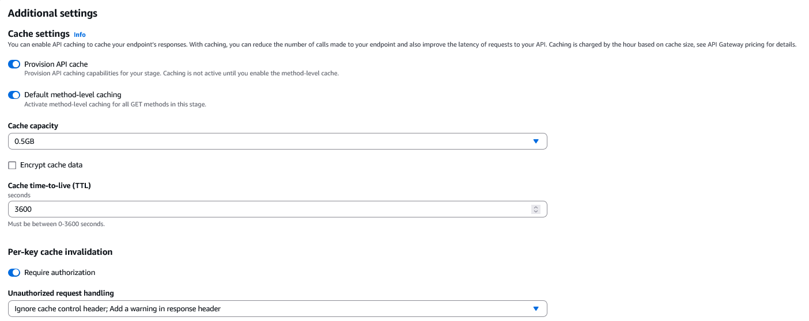
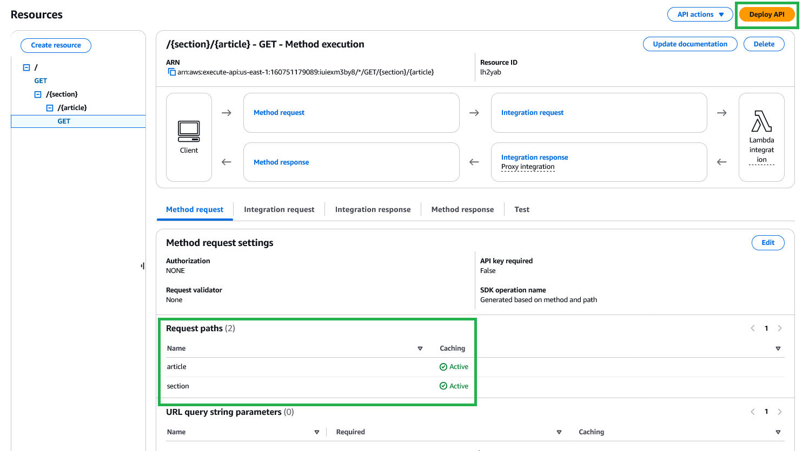

# darrenmackenzie

## How to Use

1. `. venv/Scripts/activate`.
2. `chalice deploy`.

### GitHub Actions

This repository is set up to automatically deploy to AWS Lambda using GitHub Actions. The workflow is defined in `.github/workflows/chalice-deploy.yml`.

Be sure to set the following secrets in your repository settings:
1. `AWS_ACCESS_KEY_ID`.
2. `AWS_SECRET_ACCESS_KEY`.
3. `AWS_REGION`.

## Performance

### Brotli

This application uses Brotli to compress responses.

### Caching

#### CloudFront

It is currently returning `Miss from cloudfront` for all requests. I'm still not sure why exactly. However, API Gateway level caching seems to be working at least.

##### Query Parameters

We need to modify the behavior for /articles_list: `aws cloudfront get-distribution-config --id YOUR_DISTRIBUTION_ID > config.json`

Edit config.json manually and locate the CacheBehavior for /articles_list.
1. Add "CachePolicyId": "YOUR_CACHE_POLICY_ID"
2. Add "OriginRequestPolicyId": "YOUR_ORIGIN_POLICY_ID"

#### API Gateway

Needs to be enabled from the web UI at the moment. See image below:

##### Path Level Caching

Do not forget to enable this each time you deploy:

### SEO and Accessibility

#### TODO

- [ ] Minimum font size: "Document doesn't use legible font sizesText is illegible because there's no viewport meta tag optimized for mobile screens. Font sizes less than 12px are too small to be legible and require mobile visitors to “pinch to zoom” in order to read. Strive to have >60% of page text ≥12px."
- [ ] Everything you did for `index.html` needs to be done for the other pages.
